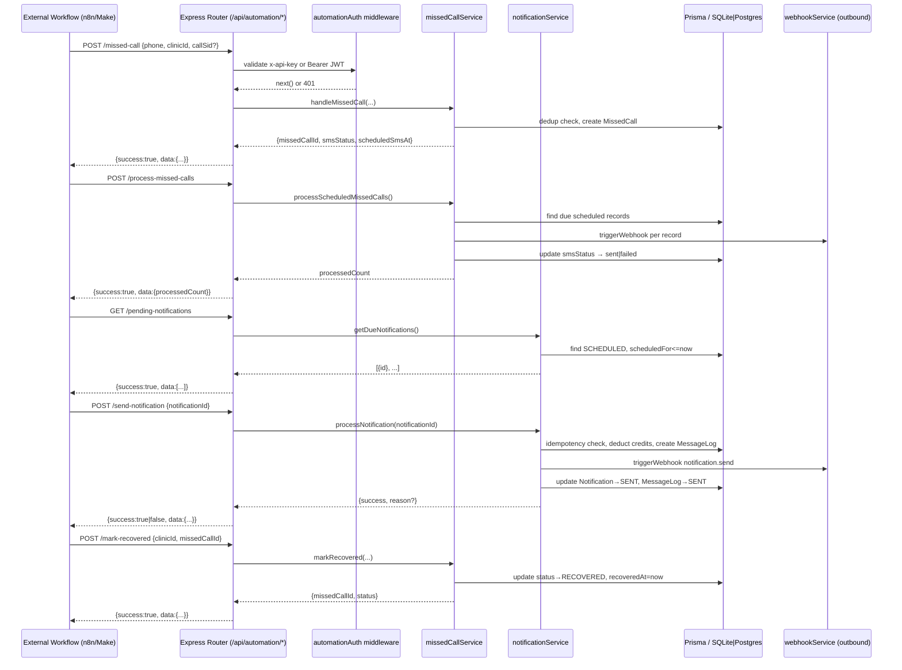
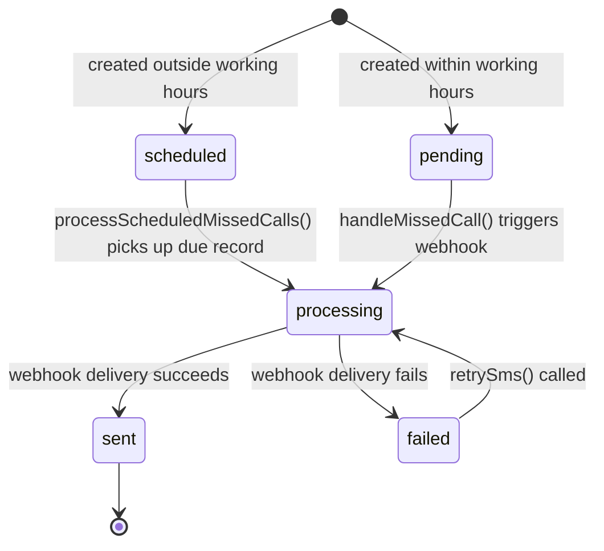
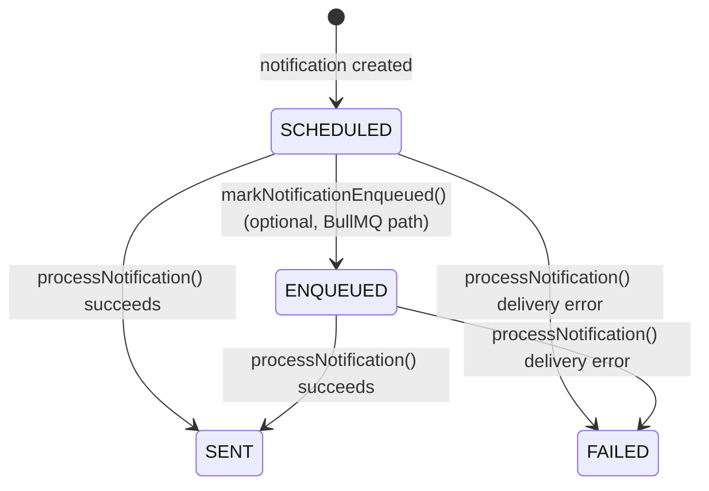

# Design Document: Workflow-Driven Recovery

## Overview

This feature hardens the existing `/api/automation/*` endpoints so that an external workflow tool (n8n, Make, or any HTTP client) can drive the complete missed-call recovery sequence end-to-end without relying on internal cron jobs or real telephony infrastructure.

The backend already has the five automation routes and the core service functions. The design work is about:

1. Ensuring every route returns the exact response shape specified in the requirements
2. Closing observability gaps (state transitions that are not currently persisted)
3. Making `mark-recovered` idempotent for already-recovered records
4. Ensuring `processScheduledMissedCalls` skips records already in `processing` state
5. Ensuring `handleMissedCall` returns `smsStatus` and `scheduledSmsAt` in the response
6. Applying `automationAuth` middleware to all five routes (currently missing from the router)

No new database fields, no new UI, no new business logic. All changes are confined to `backend/routes/automation.js`, `backend/services/missedCallService.js`, `backend/services/notificationService.js`, and `backend/middleware/automationAuth.js`.

---

## Architecture

The system follows a thin-route / thick-service pattern. Routes validate input and shape responses; services contain all business logic.



### Key Design Decisions

**Auth middleware applied at router level** — `automationAuth` is applied once as `router.use(automationAuth)` at the top of `automation.js` rather than per-route, so no route can accidentally be left unprotected.

**`USE_INTERNAL_AUTOMATION` flag** — `worker.js` already gates internal cron behind this env var. When it is `false` (the default), the external workflow is the sole driver. The design does not change this mechanism.

**No async fire-and-forget for bulk processing** — `processScheduledMissedCalls` is synchronous within the request. Requirement 12.2 allows async acknowledgement only when an operation is *expected* to exceed 5 seconds. In practice, bulk webhook calls with 3-retry exponential backoff can exceed this for large batches. The route will return synchronously for now; if latency becomes a problem, the operation can be moved to a background job and the route can return an acknowledgement immediately. This is noted as a future concern.

**Test callSid isolation via prefix** — No new DB field is needed. Analytics queries filter `callSid NOT LIKE 'test_%'`. The `callSid` column already exists and is nullable/unique.

**Workflow retry contract** — External workflows (n8n, Make) will retry any endpoint on network failure or timeout. Every automation endpoint must tolerate duplicate execution without corrupting state. This is not optional — it is a baseline contract for all endpoints in this system. See Properties 1, 6, 8, and Requirement 11.

**Locking strategy for `processScheduledMissedCalls`** — The transition from `scheduled → processing` must happen atomically in the database *before* any webhook call is made. This prevents two concurrent workflow executions from picking up the same record and sending duplicate SMS messages. The correct sequence is: `UPDATE smsStatus = 'processing' WHERE smsStatus = 'scheduled' AND scheduledSmsAt <= now` → then trigger webhook → then update to `sent` or `failed`. Records already in `processing` are skipped entirely.

**Pagination safeguard for `getDueNotifications`** — The current implementation returns all due notifications in a single response. For future scaling, `getDueNotifications` SHOULD support a `limit` parameter (e.g. 100) so that the workflow loops until the response is empty rather than receiving an unbounded batch. This does not need to be implemented now, but the workflow design should assume a loop pattern: poll → process batch → poll again until empty.

---

## Components and Interfaces

### Route: `POST /api/automation/missed-call`

**Input:**
```json
{ "phone": "+30...", "clinicId": "cuid", "callSid": "test_12345" }
```

**Success responses:**
```json
// New record, within working hours
{ "success": true, "data": { "missedCallId": "...", "smsStatus": "pending", "scheduledSmsAt": null } }

// New record, outside working hours
{ "success": true, "data": { "missedCallId": "...", "smsStatus": "scheduled", "scheduledSmsAt": "2025-01-15T09:00:00.000Z" } }

// Duplicate
{ "success": true, "data": { "duplicate": true, "missedCallId": "..." } }
```

**Gap to close:** `handleMissedCall` currently returns `{ scheduled, scheduledAt }` but the requirement specifies `{ smsStatus, scheduledSmsAt }`. The service return value must be updated to match.

---

### Route: `POST /api/automation/process-missed-calls`

**Input:** empty body

**Success response:**
```json
{ "success": true, "data": { "processedCount": 3 } }
```

**Gap to close:** Route currently returns `{ processed }` but requirement specifies `{ processedCount }`. Also, `processScheduledMissedCalls` must skip records already in `processing` state (Requirement 11.4).

---

### Route: `GET /api/automation/pending-notifications`

**Success response:**
```json
{ "success": true, "data": [{ "id": "notif_abc" }, { "id": "notif_def" }] }
```

No gaps — `getDueNotifications` already returns `[{ id }]` and the route already wraps it correctly.

---

### Route: `POST /api/automation/send-notification`

**Input:**
```json
{ "notificationId": "notif_abc" }
```

**Success responses:**
```json
// Delivered
{ "success": true, "data": {} }

// Already processed (idempotent)
{ "success": false, "data": { "reason": "Already processed" } }
```

**Error responses (HTTP 403/429):** thrown as `AppError` and handled by global error handler.

No gaps — `processNotification` already implements idempotency, credit checks, and MessageLog creation.

---

### Route: `POST /api/automation/mark-recovered`

**Input:**
```json
{ "clinicId": "cuid", "missedCallId": "cuid" }
```

**Success response:**
```json
{ "success": true, "data": { "missedCallId": "...", "status": "RECOVERED" } }
```

**Gap to close:** `markRecovered` does not currently set `recoveredAt`. It also throws 404 if the record is already `RECOVERED` — it should return success idempotently (Requirement 11.3).

---

### Middleware: `automationAuth`

Already implemented correctly. The only change is ensuring it is applied as `router.use(automationAuth)` in `automation.js` (currently the routes have no auth middleware applied).

---

## Data Models

No schema changes. All required fields already exist:

| Model | Field | Purpose |
|---|---|---|
| `MissedCall` | `callSid` | Deduplication key (unique, nullable) |
| `MissedCall` | `smsStatus` | State machine: `pending → processing → sent\|failed\|scheduled` |
| `MissedCall` | `smsError` | Last delivery error message |
| `MissedCall` | `scheduledSmsAt` | Next working-hours start when created OOH |
| `MissedCall` | `recoveredAt` | Timestamp set by `mark-recovered` |
| `MissedCall` | `status` | `DETECTED → RECOVERING → RECOVERED\|LOST` |
| `Notification` | `status` | `SCHEDULED → ENQUEUED → SENT\|FAILED` |
| `MessageLog` | `status` | `PENDING → SENT\|FAILED` |
| `MessageLog` | `error` | Delivery failure reason |
| `Clinic` | `messageCredits` | Decremented per notification sent |
| `Clinic` | `dailyUsedCount` | Incremented per notification sent |
| `Clinic` | `dailyMessageCap` | Cap enforced before delivery |

### State Machine: MissedCall.smsStatus



### State Machine: Notification.status



---

## Correctness Properties

*A property is a characteristic or behavior that should hold true across all valid executions of a system — essentially, a formal statement about what the system should do. Properties serve as the bridge between human-readable specifications and machine-verifiable correctness guarantees.*

### Property 1: Missed call creation is idempotent on callSid

*For any* clinic and any `callSid` (including `test_`-prefixed values), calling `POST /missed-call` twice with the same `callSid` and `clinicId` must return the same `missedCallId` on both calls and result in exactly one `MissedCall` record in the database.

**Validates: Requirements 1.2, 2.2, 11.2**

---

### Property 2: smsStatus at creation reflects working hours

*For any* missed call created outside configured working hours, `smsStatus` must be `scheduled` and `scheduledSmsAt` must be set to a future time. *For any* missed call created within configured working hours, `smsStatus` must be `pending` and `scheduledSmsAt` must be null.

**Validates: Requirements 1.3, 1.4**

---

### Property 3: smsStatus always reaches a terminal state after processing

*For any* set of `MissedCall` records processed by `processScheduledMissedCalls()`, after the function returns, every record that was picked up must have `smsStatus` of either `sent` or `failed` — none may remain as `processing`. When `smsStatus` is `failed`, `smsError` must be non-null.

**Validates: Requirements 3.4, 3.5, 8.1, 8.2, 8.5**

---

### Property 4: process-missed-calls only processes due scheduled records

*For any* database state containing a mix of `scheduled` (due), `scheduled` (not yet due), and `processing` records, calling `processScheduledMissedCalls()` must process exactly the records with `smsStatus = 'scheduled'` and `scheduledSmsAt <= now()`, skip all `processing` records, and return a `processedCount` equal to the number of records actually processed.

**Validates: Requirements 3.1, 3.2, 11.4**

---

### Property 5: Pending notifications filter returns only due scheduled records

*For any* database state containing notifications with various statuses and `scheduledFor` times, `getDueNotifications()` must return only records where `status = 'SCHEDULED'` and `scheduledFor <= now()`, and each result must contain only the `id` field.

**Validates: Requirements 4.1, 4.2**

---

### Property 6: Notification processing is idempotent

*For any* `Notification` whose `status` is not `SCHEDULED` or `ENQUEUED`, calling `processNotification(id)` must return `{ success: false, reason: "Already processed" }` without modifying the clinic's `messageCredits` or `dailyUsedCount`, and without creating a new `MessageLog` record.

**Validates: Requirements 5.2, 10.1, 11.1**

---

### Property 7: Notification delivery updates all state atomically and terminally

*For any* `SCHEDULED` notification, after `processNotification(id)` completes (whether delivery succeeds or fails), the `Notification.status` must be `SENT` or `FAILED`, the `MessageLog.status` must be `SENT` or `FAILED`, and both must agree — `SENT` iff the webhook call succeeded, `FAILED` iff it threw. No record may remain in `PENDING` or `ENQUEUED` state after the call returns.

**Validates: Requirements 5.1, 5.5, 8.3, 8.4, 8.5**

---

### Property 8: mark-recovered sets status and recoveredAt, and is idempotent

*For any* `MissedCall`, calling `POST /mark-recovered` must set `status = 'RECOVERED'` and `recoveredAt` to a non-null timestamp. Calling it a second time on the same record must return `{ success: true, data: { status: "RECOVERED" } }` without error and without overwriting the original `recoveredAt`.

**Validates: Requirements 6.1, 6.2, 11.3**

---

### Property 9: Authentication rejects unauthenticated requests on all endpoints

*For any* of the five automation endpoints, a request carrying neither a valid `x-api-key` header nor a valid Bearer JWT must receive HTTP 401 with `{ error: { code: "UNAUTHORIZED" } }`.

**Validates: Requirements 7.1, 7.2, 7.3**

---

### Property 10: Notification processing is concurrency-safe

*If* `processNotification(id)` is called concurrently by two or more callers, exactly one execution may deduct credits and create a `MessageLog`. All other concurrent executions must return `{ success: false, reason: "Already processed" }` without modifying `messageCredits` or `dailyUsedCount`.

This is guaranteed by the idempotency check and credit deduction occurring inside a single Prisma transaction. **The status check must never be moved outside the transaction** — doing so would introduce a TOCTOU (time-of-check/time-of-use) race condition that could result in double-charged credits.

**Validates: Requirements 10.1, 10.2, 11.1**

---

### Property 11: No MissedCall record may remain in `processing` state for more than 15 minutes

*For any* `MissedCall` record with `smsStatus = 'processing'`, if the record has been in that state for more than 15 minutes, it indicates a stuck execution (crash, timeout, or unhandled error). Such records SHOULD be recoverable by re-running `processScheduledMissedCalls` after resetting their `smsStatus` back to `scheduled`.

This property does not require automated recovery to be implemented now. It defines the expected operational behaviour so that future maintainers know: a record stuck in `processing` is always a recoverable error state, never a valid terminal state.

**Validates: Requirements 8.5, 11.1**

---

## Error Handling

All errors are thrown as `AppError(code, message, httpStatus)` and handled by the global Express error handler, which serializes them as `{ error: { code, message } }`.

| Scenario | HTTP Status | Error Code |
|---|---|---|
| Missing required body field | 400 | `VALIDATION_ERROR` |
| Clinic not found | 404 | `NOT_FOUND` |
| MissedCall not found | 404 | `NOT_FOUND` |
| Notification not found | 404 | `NOT_FOUND` |
| Insufficient message credits | 403 | `INSUFFICIENT_CREDITS` |
| Daily message cap reached | 429 | `DAILY_CAP_REACHED` |
| Missing auth | 401 | `UNAUTHORIZED` |
| Invalid API key | 401 | `INVALID_API_KEY` |
| API key not configured | 401 | `NO_API_KEY_CONFIGURED` |
| Webhook delivery failed | 502 | `DELIVERY_FAILED` |

**No silent failures:** every catch block either updates the relevant record's error field in the DB or re-throws. The `processNotification` function updates `MessageLog.status = 'FAILED'` and `MessageLog.error` before re-throwing. The `processScheduledMissedCalls` function updates `smsStatus = 'failed'` and `smsError` before continuing to the next record.

---

## Testing Strategy

### Unit Tests

Focus on specific examples, integration points, and error conditions:

- `handleMissedCall` returns duplicate response when `callSid` already exists
- `handleMissedCall` sets `smsStatus = 'scheduled'` when outside working hours
- `handleMissedCall` sets `smsStatus = 'pending'` when within working hours
- `markRecovered` sets `recoveredAt` timestamp
- `markRecovered` returns success when called on already-recovered record
- `processNotification` throws `INSUFFICIENT_CREDITS` when credits are zero
- `processNotification` throws `DAILY_CAP_REACHED` when cap is reached
- `automationAuth` returns 401 when no credentials provided
- `automationAuth` returns 401 when `AUTOMATION_API_KEY` env var is not set

### Property-Based Tests

Use [fast-check](https://github.com/dubzzz/fast-check) (JavaScript PBT library). Each test runs a minimum of 100 iterations.

Each test is tagged with: `// Feature: workflow-driven-recovery, Property N: <property text>`

**Property 1 — Missed call creation is idempotent on callSid**
Generate random `phone`, `clinicId` (seeded clinic), and `callSid` (including `test_`-prefixed variants). Call `handleMissedCall` twice with the same inputs. Assert both calls return the same `missedCallId` and the DB contains exactly one record with that `callSid`.
`// Feature: workflow-driven-recovery, Property 1: missed call creation is idempotent on callSid`

**Property 2 — smsStatus at creation reflects working hours**
Generate a clinic with known working hours. Call `handleMissedCall` with a timestamp inside working hours and assert `smsStatus = 'pending'`, `scheduledSmsAt = null`. Call again with a timestamp outside working hours and assert `smsStatus = 'scheduled'`, `scheduledSmsAt` is a future time.
`// Feature: workflow-driven-recovery, Property 2: smsStatus at creation reflects working hours`

**Property 3 — smsStatus always reaches a terminal state after processing**
Seed a set of `MissedCall` records with `smsStatus = 'scheduled'` and `scheduledSmsAt` in the past. Mock `triggerWebhook` to succeed or fail randomly. Call `processScheduledMissedCalls()`. Assert every processed record has `smsStatus` of `sent` or `failed`, and records with `failed` have non-null `smsError`.
`// Feature: workflow-driven-recovery, Property 3: smsStatus always reaches a terminal state after processing`

**Property 4 — process-missed-calls only processes due scheduled records**
Seed a mix of `scheduled` (due), `scheduled` (not yet due), and `processing` records. Call `processScheduledMissedCalls()`. Assert `processedCount` equals only the count of due `scheduled` records, `processing` records are untouched, and not-yet-due records are untouched.
`// Feature: workflow-driven-recovery, Property 4: process-missed-calls only processes due scheduled records`

**Property 5 — Pending notifications filter returns only due scheduled records**
Seed notifications with various statuses (`SCHEDULED`, `SENT`, `FAILED`) and `scheduledFor` times (past and future). Call `getDueNotifications()`. Assert every returned record has `status = 'SCHEDULED'` and `scheduledFor <= now`, and no non-qualifying records are included.
`// Feature: workflow-driven-recovery, Property 5: pending notifications filter returns only due scheduled records`

**Property 6 — Notification processing is idempotent**
Generate a `Notification` with status `SENT` or `FAILED`. Record the clinic's `messageCredits` and `MessageLog` count. Call `processNotification(id)`. Assert result is `{ success: false, reason: "Already processed" }`, `messageCredits` is unchanged, and no new `MessageLog` was created.
`// Feature: workflow-driven-recovery, Property 6: notification processing is idempotent`

**Property 7 — Notification delivery updates all state atomically and terminally**
Generate a `SCHEDULED` notification. Mock `triggerWebhook` to succeed or fail randomly. Call `processNotification`. Assert `Notification.status` is `SENT` or `FAILED`, `MessageLog.status` matches, and neither is left in `PENDING` or `ENQUEUED`.
`// Feature: workflow-driven-recovery, Property 7: notification delivery updates all state atomically and terminally`

**Property 8 — mark-recovered sets status and recoveredAt, and is idempotent**
Generate a `MissedCall` in any non-recovered state. Call `markRecovered`. Assert `status = 'RECOVERED'` and `recoveredAt` is set. Call again. Assert the response is still success and `recoveredAt` is unchanged.
`// Feature: workflow-driven-recovery, Property 8: mark-recovered sets status and recoveredAt, and is idempotent`

**Property 9 — Authentication rejects unauthenticated requests on all endpoints**
For each of the five automation routes, generate a request with no `x-api-key` and no `Authorization` header. Assert HTTP 401 with `{ error: { code: "UNAUTHORIZED" } }`.
`// Feature: workflow-driven-recovery, Property 9: authentication rejects unauthenticated requests on all endpoints`

**Property 10 — Notification processing is concurrency-safe**
Simulate two concurrent calls to `processNotification(id)` on the same `SCHEDULED` notification (e.g. using `Promise.all`). Assert that exactly one call returns `{ success: true }`, the other returns `{ success: false, reason: "Already processed" }`, exactly one `MessageLog` record exists for the notification, and `messageCredits` was decremented exactly once.
`// Feature: workflow-driven-recovery, Property 10: notification processing is concurrency-safe`

**Property 11 — No record remains stuck in processing indefinitely**
Seed a `MissedCall` with `smsStatus = 'processing'` and `updatedAt` more than 15 minutes in the past. Assert that the record is identifiable as stuck (i.e. `smsStatus = 'processing'` AND `updatedAt < now - 15min`). Assert that resetting `smsStatus` to `scheduled` and re-running `processScheduledMissedCalls` successfully processes the record to a terminal state.
`// Feature: workflow-driven-recovery, Property 11: no record remains stuck in processing indefinitely`

### End-to-End Integration Test (Example)

Run the complete sequence using a `test_` callSid and assert the final state:
1. `POST /missed-call` with `callSid: "test_e2e_001"` → assert `missedCallId` returned
2. `POST /process-missed-calls` → assert `processedCount >= 0`
3. `GET /pending-notifications` → collect notification IDs
4. `POST /send-notification` for each ID → assert `success: true`
5. `POST /mark-recovered` → assert `status: "RECOVERED"`
6. Query DB: assert `MissedCall.status = RECOVERED`, `Notification.status = SENT`, `MessageLog.status = SENT`
